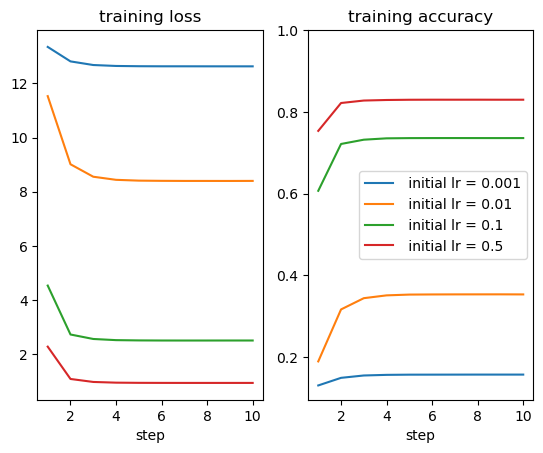
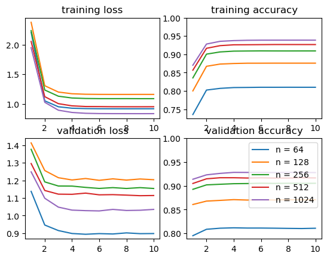
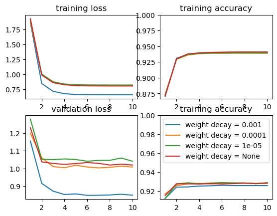
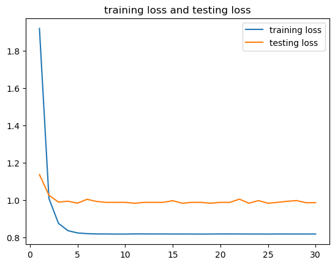
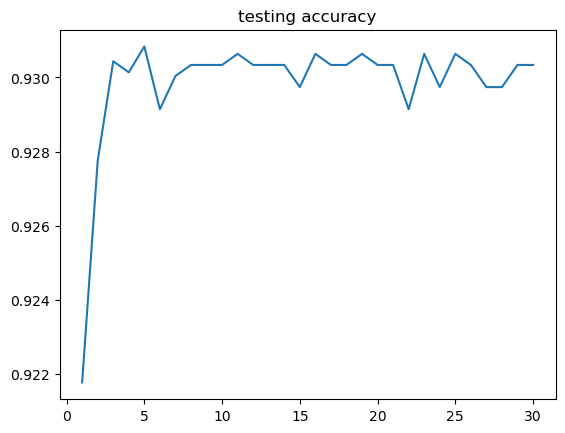
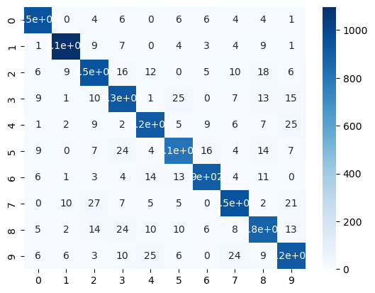

# FCN with numpy for handwritten digits recognition
This is a project for DATA620004.01 Neural Network and Deep Learning.

The project is structured as follows.

- `MNIST` is the directory for training and testing data.
- The `nn` module includes buiding blocks for constructing and training the neural network. 
  - General `Module` with `forward()` and `backward()` of any neural network is defined in `nn.py`
  - `ReLU`,`Softmax`, `Linear` and `CrossEntropyLoss` with their gradient caculation and backward propagation are  in `functional.py`
  - `SGD` with weight decay (= L2 regularization) $w_{t+1}=(1-\lambda \eta_t)w_t-\eta_t\nabla w_t,b_{t+1}=(1-\lambda \eta_t)b_t-\eta_t\nabla b_t$ and `ExponentialScheduler` $\eta_t = \eta_0 \times\alpha^{\text{floor}(t/T)}$ are defined in `optim.py`
  - `Dataloader` is defined in `dataloader.py`
- Hyperparameter search, training, visualization, model saving and testing are performed with `main.ipynb`.

```
├── MNIST
│   ├── t10k-images-idx3-ubyte
│   ├── t10k-labels-idx1-ubyte
│   ├── train-images-idx3-ubyte
│   └── train-labels-idx1-ubyte
├── nn
│   ├── dataloader.py
│   ├── functional.py
│   ├── nn.py
│   └── optim.py
└── main.ipynb
```


## 1. Data

Handwritten digits (0-9) from MNIST dataset are 28 $\times$ 28 in size. The grayscale images are rescaled to the range 0-1 before training and testing. We used 6oooo items  for training, and 10000 for testing, both with a batchsize of 64.

## 2. Hyperparameter search

Hyperparameters in exponential scheduler is set as: $\alpha = 0.5, T=500$. We only searched for the initial learning rate $\eta_0$, size of the hidden layer $n$ and weight decay $\lambda$ sequentially. During search for hyperparameter, we train 10 epoches for each candidate.

#### Step 1: choose an initial learning rate
We set the size of hidden neurons = 64, and weight decay = 0 to choose the initial learning rate from [1e-3, 1e-2, 1e-1, .5]
Initial learning rate should be set to 0.5 for faster convergence



    


#### Step 2: choose the size of hidden layers
We set initial learning rate = 0.5, and weight decay = 0 to choose the size of the hidden layer from [64, 128, 256, 512]
Size of the hidden layer should be set to 1024 for better training and validation performance.


​    

​    


#### Step 3: choose the weight decay intensity
We set initial learning rate = 0.5, and size of hidden layers = 1024 to choose the weight decay from [1e-3, 1e-4, 1e-5, None]
Weight decay intensity should be set to 1e-5 to achieve the best validation accuracy.


​    

​    


## 3. Training
We trained the model for 30 epoches with the searched initial learning rate = 0.5,  size of hidden layers = 1024, and weight decay intensity = 1e-5. Since we tested the model on testing set every epoch during training,  we can draw the in-process training loss and testing loss together. We stored the model after the final epoch. 
    


## 4. Testing

Here is the testing accuracy during training.


​    

The model can be loaded for testing. Here is a confusion matrix and a classification report on our testing data.



|              | precision | recall | f1-score | support |
| ------------ | --------- | ------ | -------- | ------- |
| 0            | 0.96      | 0.97   | 0.96     | 980     |
| 1            | 0.97      | 0.97   | 0.97     | 1135    |
| 2            | 0.92      | 0.92   | 0.92     | 1032    |
| 3            | 0.90      | 0.92   | 0.91     | 1010    |
| 4            | 0.93      | 0.93   | 0.93     | 982     |
| 5            | 0.92      | 0.90   | 0.91     | 892     |
| 6            | 0.95      | 0.94   | 0.95     | 958     |
| 7            | 0.93      | 0.93   | 0.93     | 1028    |
| 8            | 0.91      | 0.91   | 0.91     | 974     |
| 9            | 0.91      | 0.91   | 0.91     | 1009    |
| Accuracy     |           |        | 0.93     | 10000   |
| Macro avg    | 0.93      | 0.93   | 0.93     | 10000   |
| Weighted avg | 0.93      | 0.93   | 0.93     | 10000   |

